# Analysis and Visualizations

## Heatmaps for Each Observer

For each observer, a heatmap was generated where rows represent the models and columns represent the scoring dimensions. The cell values show the average scores provided by each observer for the given model and dimension.

### Observer: Clusmann
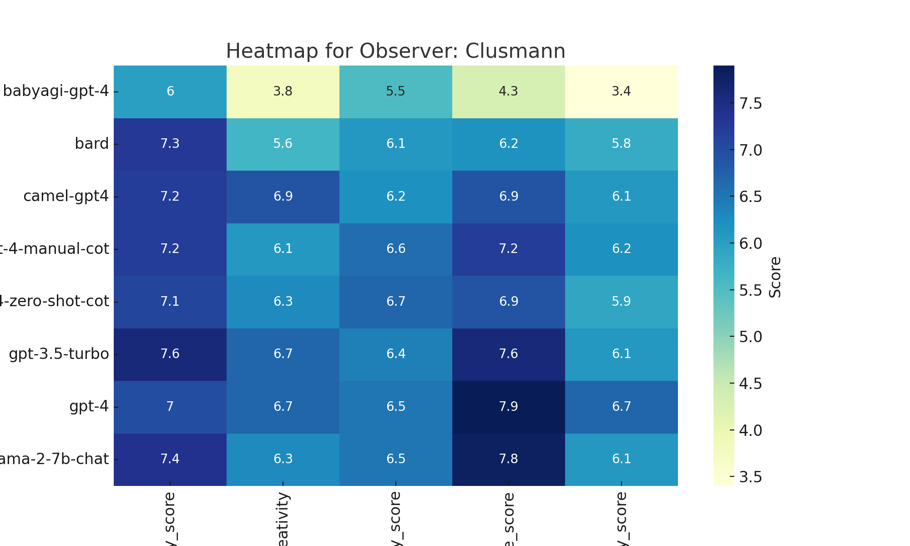

### Observer: Dyke
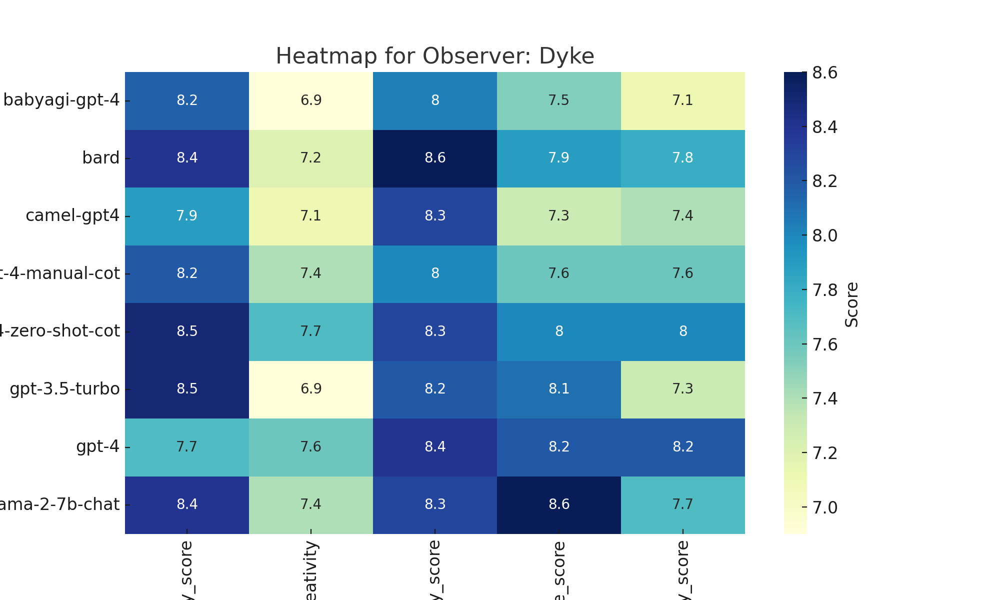

### Observer: Isabella
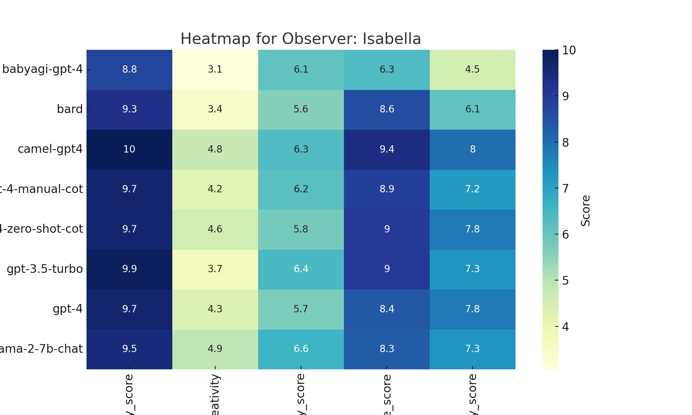

### Observer: Kather
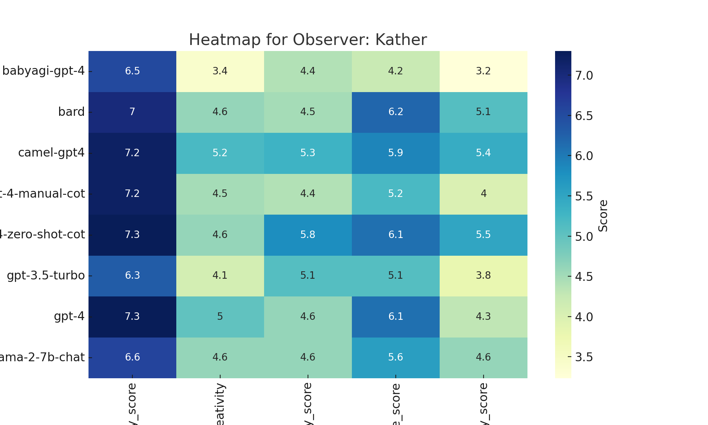

### Observer: Schneider

### Observer: Truhn
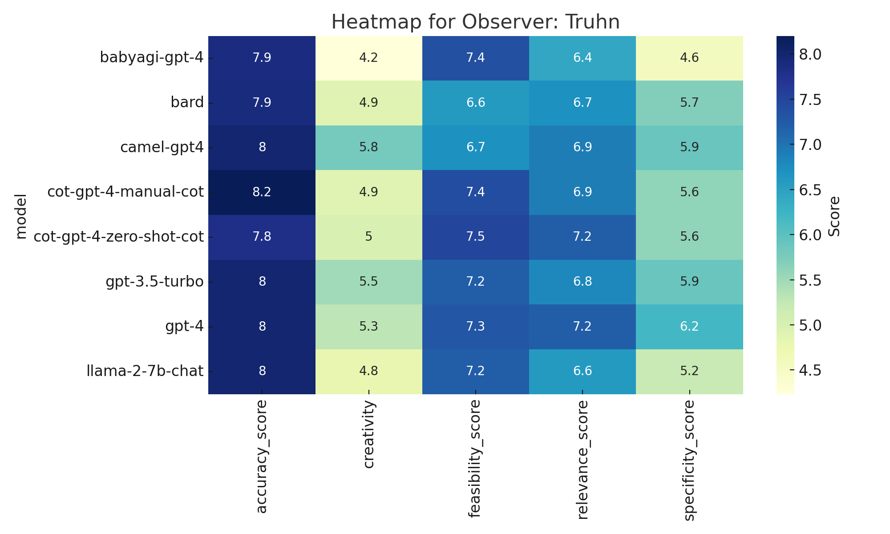

## Median Scores Heatmap

The heatmap below displays the median scores for each model across the scoring dimensions.

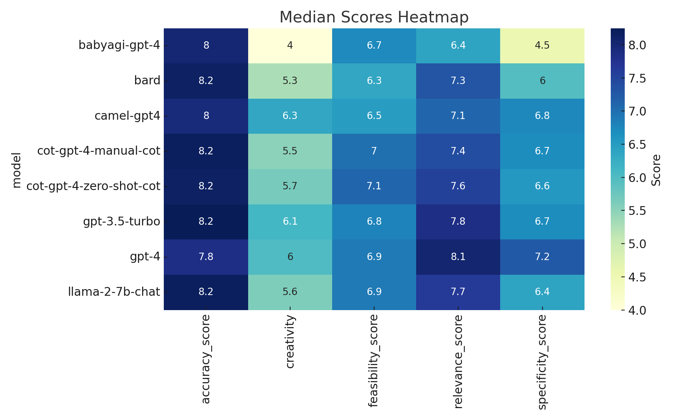

## Box Plots for Each Model

The box plots provide a distribution of scores for each model across the five dimensions. Each box plot represents one scoring dimension, and the boxes within each plot represent the different models.

### Boxplot for accuracy_score
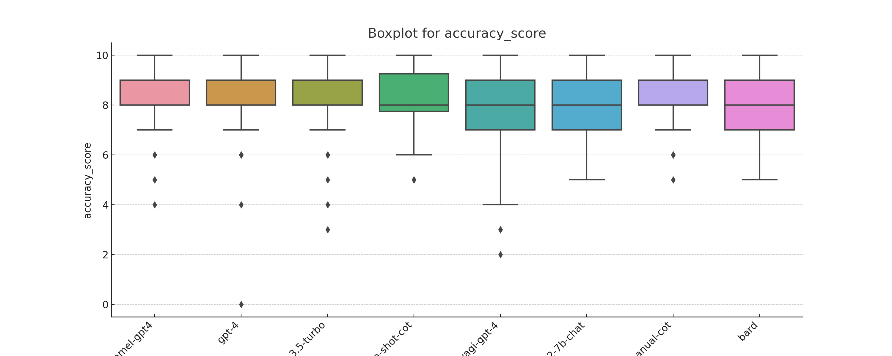

### Boxplot for relevance_score
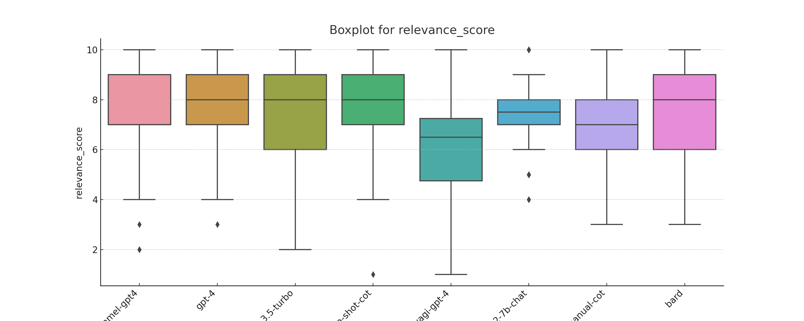

### Boxplot for creativity

### Boxplot for specificity_score
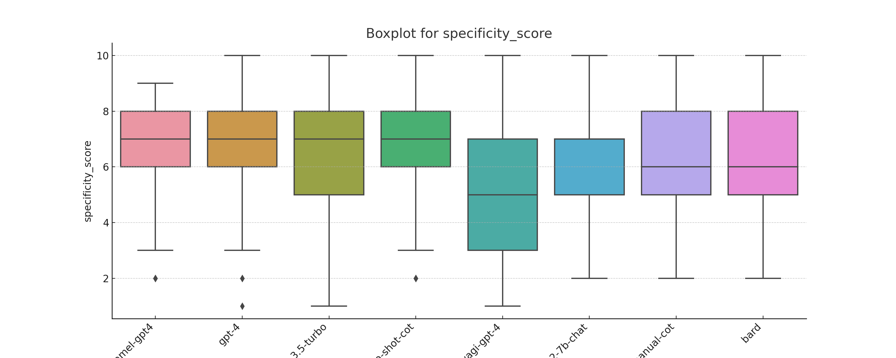

### Boxplot for feasibility_score
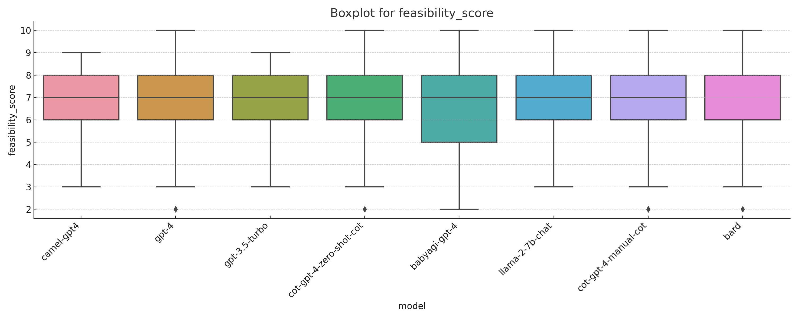

## Pairwise Correlation between Observers

The heatmap below shows the pairwise Spearman rank correlation coefficients between observers. A high positive value indicates strong agreement between two observers in their scoring, while a low or negative value indicates disagreement or weak agreement.

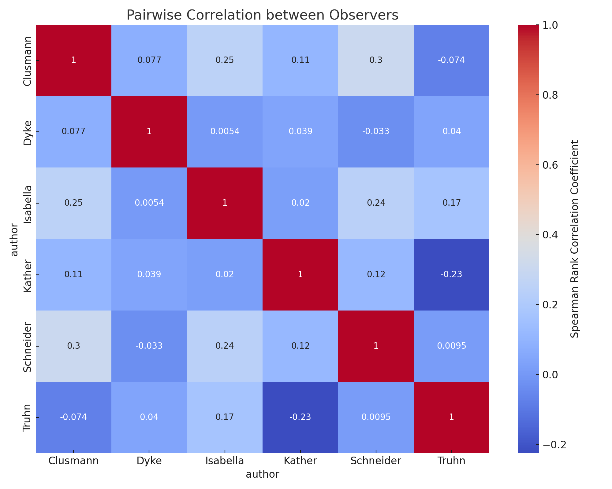

